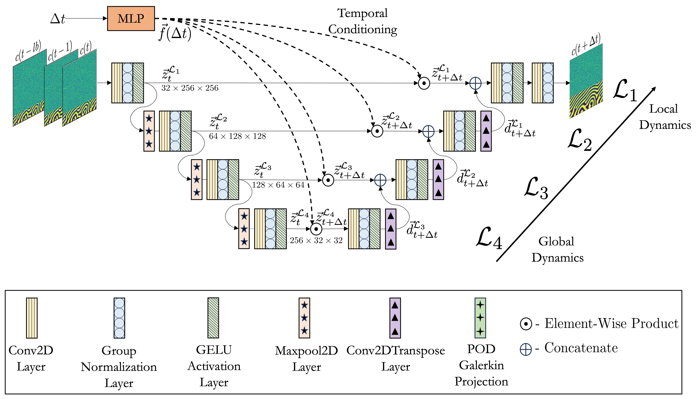

# Rethinking materials simulations: Blending direct numerical simulations with neural operators - [Link](https://arxiv.org/abs/2312.05410)

## Abstract
Materials simulations based on direct numerical solvers are accurate but computationally expensive for predicting materials evolution across length- and timescales, due to the complexity of the underlying evolution equations, the nature of multiscale spatiotemporal interactions, and the need to reach long-time integration. We develop a method that blends direct numerical solvers with neural operators to accelerate such simulations. This methodology is based on the integration of a community numerical solver with a U-Net neural operator, enhanced by a temporal-conditioning mechanism to enable accurate extrapolation and efficient time-to-solution predictions of the dynamics. We demonstrate the effectiveness of this hybrid framework on simulations of microstructure evolution via the phase-field method. Such simulations exhibit high spatial gradients and the co-evolution of different material phases with simultaneous slow and fast materials dynamics. We establish accurate extrapolation of the coupled solver with large speed-up compared to DNS depending on the hybrid strategy utilized. This methodology is generalizable to a broad range of materials simulations, from solid mechanics to fluid dynamics, geophysics, climate, and more.

## Architecture: UNet with temporal-conditioning

## Test trajectories predicted by the Hybrid Model (Speedup 2.27x)
### 1) Physical Vapour Deposition

### 2) Dendritic Microstructures

### 3) Spinodal Decomposition

## Citation

    @article{oommen2024rethinking,
      title={Rethinking materials simulations: Blending direct numerical simulations with neural operators},
      author={Oommen, Vivek and Shukla, Khemraj and Desai, Saaketh and Dingreville, R{\'e}mi and Karniadakis, George Em},
      journal={npj Computational Materials},
      volume={10},
      number={1},
      pages={145},
      year={2024},
      publisher={Nature Publishing Group UK London}
    } 

