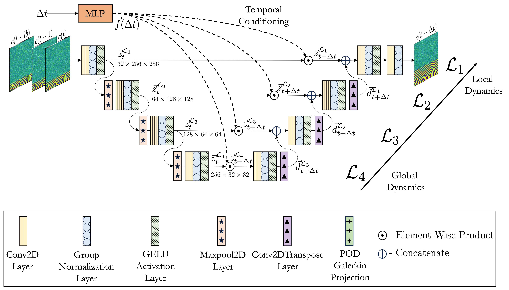

# UNet-with-temporal-conditioning

# Test trajectory predicted by the Hybrid Model

# Citation

    @misc{oommen2023rethinking,
      title={Rethinking materials simulations: Blending direct numerical simulations with neural operators}, 
      author={Vivek Oommen and Khemraj Shukla and Saaketh Desai and Remi Dingreville and George Em Karniadakis},
      year={2023},
      eprint={2312.05410},
      archivePrefix={arXiv},
      primaryClass={cs.LG}
}
